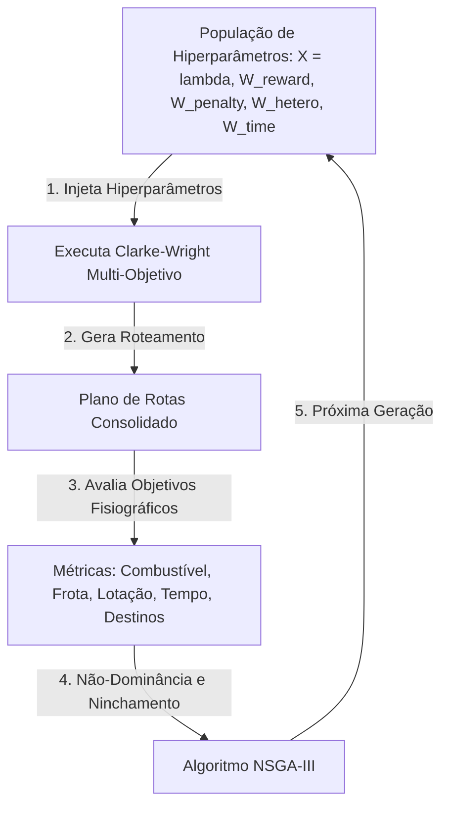

# Proposta: Otimização Evolutiva Multi-Objetivo (NSGA-III) para Calibração de Hiperparâmetros

Este documento detalha a arquitetura para implementar **Otimização Evolutiva Multi-Objetivo** usando o algoritmo **NSGA-III** no projeto de roteamento da UNIVASF. O objetivo é sintonizar de forma robusta e simultânea os parâmetros da heurística Clarke-Wright Multi-Objetivo.

---

## 1. Por que o NSGA-III?

Diferente do Grid Search ou da Otimização Bayesiana tradicional de objetivo único:
* **Múltiplos Objetivos Reais:** O problema de transporte da UNIVASF possui múltiplos objetivos conflitantes: menor custo de combustível, menor frota de ônibus, menor superlotação de passageiros, trajetos rápidos (dentro de 90 min) e rotas com destinos homogêneos.
* **Fronteira de Pareto:** Em vez de definir pesos estáticos arbitrários para juntar tudo em uma única nota numérica de custo, o **NSGA-III** (Non-dominated Sorting Genetic Algorithm III) trata cada objetivo de forma independente. Ele encontra a **Fronteira de Pareto**: um conjunto de soluções ideais onde nenhuma métrica pode ser melhorada sem prejudicar outra.
* **Escalabilidade para >3 Objetivos:** O NSGA-II clássico perde pressão de seleção ao lidar com mais de 3 objetivos. O NSGA-III resolve isso introduzindo **pontos de referência** no espaço de objetivos, mantendo a diversidade e guiando a busca em direção a soluções uniformemente distribuídas na fronteira de trade-off.

---

## 2. Modelagem do Problema de Otimização

### 2.1. Variáveis de Decisão (Cromossomo)
O algoritmo evolutivo controlará um vetor de 5 variáveis de decisão contínuas/reais ($X$), que servem de entrada para guiar as decisões de construção de rotas da heurística:

| Hiperparâmetro | Tipo | Intervalo de Busca | Função no Algoritmo |
| :--- | :---: | :---: | :--- |
| $\lambda$ | Real | $[0.1, 3.0]$ | Balanço de Savings clássico (atração geométrica de paradas). |
| $W_{\text{OCC\_REWARD}}$ | Real | $[10.0, 500.0]$ | Recompensa por preenchimento eficiente do veículo. |
| $W_{\text{OCC\_PENALTY}}$ | Real | $[500.0, 5000.0]$ | Penalidade exponencial por superlotar ou rodar vazio. |
| $W_{\text{HETEROGENEITY}}$ | Real | $[10.0, 300.0]$ | Penalidade por misturar múltiplos campi de destino na mesma rota. |
| $W_{\text{TIME\_PENALTY}}$ | Real | $[100.0, 3000.0]$ | Penalidade por estourar o limite de tempo estrito (90 min). |

### 2.2. Funções Objetivo a Minimizar ($F(X)$)
Diferente da heurística interna (que usa a função matemática para guiar a construção passo a passo), o algoritmo evolutivo avalia o **plano de rotas resultante consolidado** sob os seguintes 5 objetivos independentes:

1. **$f_1(X)$ - Custo de Combustível ($R\$$):** Soma do consumo de combustível de todas as rotas ativas.
2. **$f_2(X)$ - Tamanho da Frota:** Número total de veículos (rotas) necessários para atender o turno.
3. **$f_3(X)$ - Superlotação / Desconforto:** Quantidade acumulada de passageiros acima do limite de conforto em todos os trechos das rotas.
4. **$f_4(X)$ - Heterogeneidade Acumulada:** Soma da heterogeneidade (desvios de destino) de todas as rotas geradas.
5. **$f_5(X)$ - Estouro de Tempo (minutos):** Soma de todos os minutos que excederam o tempo regulamentar de 90 minutos em cada rota.

---

## 3. Arquitetura de Execução e Integração com `pymoo`

A biblioteca mais recomendada em Python para otimização evolutiva robusta é a **`pymoo`** (Python Multi-objective Optimization). O diagrama abaixo descreve o ciclo de avaliação de cada indivíduo da população:



---

## 4. Esboço de Implementação Conceptual em Python

Abaixo está o modelo conceitual de como a classe do problema seria implementada utilizando a biblioteca `pymoo`:

```python
import numpy as np
from pymoo.core.problem import ElementwiseProblem
from pymoo.algorithms.moo.nsga3 import NSGA3
from pymoo.optimize import minimize
from pymoo.util.ref_dirs import get_reference_directions
from pymoo.operators.crossover.sbx import SimulatedBinaryCrossover
from pymoo.operators.mutation.pm import PolynomialMutation

from algorithms.clarke_wright_multi import clarke_wright_multi_ovrp
import algorithms.clarke_wright_multi as cw_multi

class TransporteUnivasfProblem(ElementwiseProblem):

    def __init__(self, nos, matriz_dist, matriz_tempo, viagens, deposito, capacidade, conforto, modelo, max_tempo):
        # 5 variáveis de decisão e 5 objetivos independentes
        super().__init__(
            n_var=5,
            n_obj=5,
            xl=np.array([0.1, 10.0, 500.0, 10.0, 100.0]),  # Limites inferiores
            xu=np.array([3.0, 500.0, 5000.0, 300.0, 3000.0]) # Limites superiores
        )
        self.nos = nos
        self.matriz_dist = matriz_dist
        self.matriz_tempo = matriz_tempo
        self.viagens = viagens
        self.deposito = deposito
        self.capacidade = capacidade
        self.conforto = conforto
        self.modelo = modelo
        self.max_tempo = max_tempo

    def _evaluate(self, x, out, *args, **kwargs):
        # 1. Desempacota os genes (hiperparâmetros sugeridos pela geração atual)
        lam, w_reward, w_penalty, w_hetero, w_time = x

        # 2. Injeta os pesos temporariamente no módulo de Clarke-Wright
        cw_multi.W_OCC_REWARD = w_reward
        cw_multi.W_OCC_PENALTY = w_penalty
        cw_multi.W_HETEROGENEITY = w_hetero
        cw_multi.W_TIME_PENALTY = w_time

        # 3. Executa o algoritmo de Roteamento Sequencial
        rotas, _ = clarke_wright_multi_ovrp(
            nos=self.nos,
            matriz_dist=self.matriz_dist,
            matriz_tempo=self.matriz_tempo,
            viagens=self.viagens,
            deposito=self.deposito,
            capacidade=self.capacidade,
            conforto=self.conforto,
            modelo=self.modelo,
            max_tempo=self.max_tempo,
            lam=lam,
            verbose=False
        )

        if not rotas:
            # Penalidade massiva em todos os objetivos se a rota falhar completamente
            out["F"] = [999999.0, 99.0, 999999.0, 999999.0, 999999.0]
            return

        # 4. Avaliação individual de cada um dos 5 objetivos (quanto menor, melhor)
        
        # Objetivo 1: Custo total de combustível (R$)
        custo_combustivel = sum(r.custo_brl for r in rotas)
        
        # Objetivo 2: Frota de ônibus (número de rotas)
        frota = len(rotas)
        
        # Objetivo 3: Superlotação física total (passageiros acima do limite confortável)
        superlotados = 0
        for r in rotas:
            for carga in r.cargas_trecho:
                if carga > self.conforto:
                    superlotados += (carga - self.conforto)
                    
        # Objetivo 4: Heterogeneidade total (quantidade de destinos distintos)
        hetero_total = 0
        for r in rotas:
            destinos = set(t["desembarque"] for t in r.viagens_atendidas)
            if len(destinos) > 1:
                hetero_total += (len(destinos) - 1)
                
        # Objetivo 5: Estouro de tempo (soma de minutos extras além de 90 min)
        minutos_excedentes = 0.0
        for r in rotas:
            if r.tempo_min > self.max_tempo:
                minutos_excedentes += (r.tempo_min - self.max_tempo)

        # Retorna o vetor F contendo os 5 valores de objetivos a serem minimizados
        out["F"] = [
            custo_combustivel,
            float(frota),
            float(superlotados),
            float(hetero_total),
            minutos_excedentes
        ]

# Exemplo de configuração da execução do NSGA-III
def rodar_otimizacao_nsga3(nos, matriz_dist, matriz_tempo, viagens, deposito, capacidade, conforto, modelo, max_tempo):
    problem = TransporteUnivasfProblem(
        nos, matriz_dist, matriz_tempo, viagens, deposito, capacidade, conforto, modelo, max_tempo
    )

    # Gera direções de referência (essencial para o nichamento do NSGA-III com 5 objetivos)
    ref_dirs = get_reference_directions("energy", 5, 90, seed=1)

    algorithm = NSGA3(
        pop_size=100,
        ref_dirs=ref_dirs,
        crossover=SimulatedBinaryCrossover(eta=30, prob=0.9),
        mutation=PolynomialMutation(eta=20, prob=0.2),
        eliminate_duplicates=True
    )

    res = minimize(
        problem,
        algorithm,
        termination=('n_gen', 50), # 50 gerações
        seed=1,
        verbose=True
    )
    
    print("\n=== FRONTEIRA DE PARETO ENCONTRADA ===")
    print("Variáveis de Decisão (lambda, w_reward, w_penalty, w_hetero, w_time):")
    print(res.X)
    print("Objetivos correspondentes (combustível, frota, lotação, destinos, tempo):")
    print(res.F)
    
    return res
```

---

## 5. Resultados Esperados

1. **Escolha Consciente de Compromisso:** O usuário final não precisa "adivinhar" o peso ideal. Ele recebe uma lista de soluções da fronteira de Pareto (por exemplo, uma rota que usa 4 ônibus muito confortáveis versus uma rota que usa 3 ônibus com maior lotação) e escolhe a que melhor se adapta à realidade financeira e operacional do dia.
2. **Eficiência no Rastreamento:** O NSGA-III gera pontos que mapeiam o limite físico das capacidades do Clarke-Wright Multi-Objetivo na UNIVASF, explicitando os reais gargalos das rotas.
